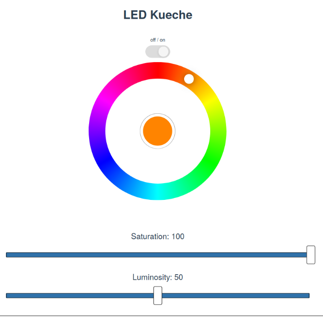

# smart-led
Smart Home project for controlling LED strips with a web application.
This mainly meant to be taken as an inspiration for other who want to
 implement a similar project.
 


Screenshot of the frontend application to set the LED strip state.

## Introduction
This project uses WS2812 LED strips and ESP8266 WiFi controller to control 
LED strips via WiFi. It also contains a web application to control multiple 
LED strips with a graphical frontend. This web application will need a device to
 run on. In my case I used a Raspberry Pi 3. 


## Set up LED Strip and WiFi Controller

### Soldering together LED Strip and ESP8266
   TODO:
   - list of parts needed
   - circuit diagram
   
### Flashing software on ESP8266
The ESP8266 can be flashed with the standard Arduino IDE. Download it and set it
up to find your ESP8266, the detailed process for that might depend on your
 operating system and there are plenty of resources describing it.

The file to be flashed on to your ESP8266 can be found
[here](esp8266/led_rest_api/led_rest_api.ino).
You will need to adjust some settings in this file before flashing it, such
 as your WiFi credentials, the pin you're using on the ESP8266, and the
  number of LEDs on your strip. All these settings are at the top of the file
   and are explained there.
   
Once you've flashed the file onto the ESP8266, you can test it by sending a
 simple http PUT request to the Controller. For example to set its color to
  red, send a request with curl:
  
  ```
  curl -i -X PUT -d'{"r":255, "g":0, "b":0, "power": 1}' http://[ESP8266_IP]/leds
  ```

Also check that you entered the correct IP address and port for your backend
 server in this script, as this is important for the device to be able to
  register itself on start up.

## Set up backend
TODO:
  - requirements
 
The backend handles http PUT requests from the frontend application to set
the state of a certain LED strip with a RGB color and an on/off variable.
The current states for all LED strips are stored in a sqlite3 database, so
that the access is thread-safe. If you want the backend to forget all devices
, which have registered, simply delete `devices.db`. The backend will create
 a new database automatically, if there is none.

The backend is implemented as a flask app, so to test it, simply start it with
 `python
 backend.py`, but you can also use a proper WSGI server. I made this script a
  service on my  Raspberry Pi, so that it automatically starts when the Pi
   boots.
   
## Set up frontend
The frontend is served at the root directory of the flask app as a
backup, but you should use a webserver such as nginx or lighttpd, as this
will probably be more stable.

The backend communicates the current state of all LED strips live to all
connected frontend clients via websockets, so that the state displayed
always matches the actual state of the LED strip.
 
For this to work, you will have to set up a proxy path in the webserver. You
 will need to proxy all traffic send to `/ws/socket.io/` to the port of your
  backend. The exact way to do this will depend on the serving application
   you are using. In my case (using nginx and my backend port being 4999), the
    nginx site configuration file looks like this:
    
```
server {
   listen 80;
   listen [::]80;

   root [root directory of your project]/smart-led/frontend/dist;

   index index.html;

   location /ws/socket.io/ {
      proxy_set_header Upgrade $http_upgrade;
      proxy_set_header Connection "upgrade";
      proxy_http_version 1.1;
      proxy_set_header X-Forwarded-For $proxy_add_x_forwarded_for;
      proxy_set_header Host $host;
      proxy_pass http://localhost:4999;
   }
}
```
NOTE: This is necessary because my backend and frontend do not listen to the
 same port. It is possible to handle this differently by letting the
  flask backend app serve the frontend application, but this could
   theoretically lead to a performance issue, as it is not recommended to serve
    static directories with flask in production. 
    
## Usage
Once you set up your ESP8266 with LED strips, the frontend, and the backend, you
can start controlling your led strips:

1) Make sure your frontend app and backend app are running.

2) Switch on the power on your LED strip with the ESP8266.\
It is important, that you do this **after** your backend has started, because
the LED strip needs to register itself with the backend, and it does this on
start up.

3) You should now be ready to control your LED strip with the web interface: 
Go to the IP address of your backend and frontend serving device (in my
case the Raspberry Pi) and you should see something similar to the screenshot
above. 

